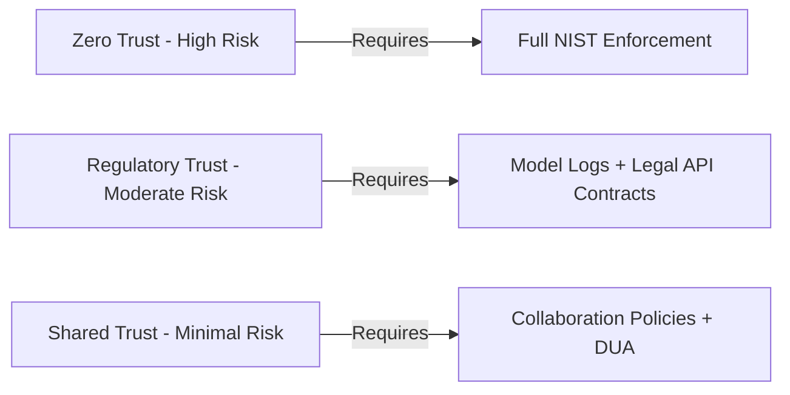
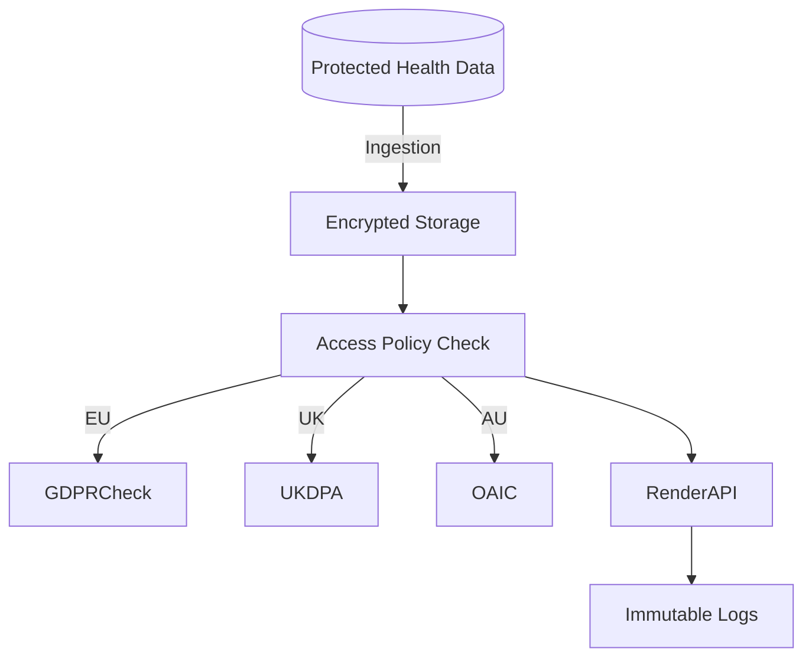
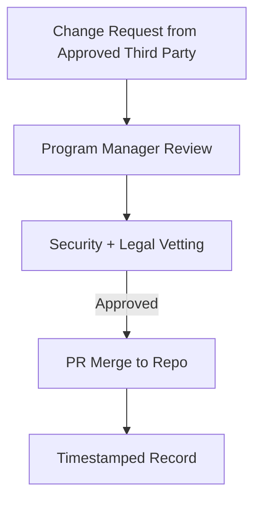

# 🛡️ Founder's Flight Deck – Governance README (Simulated)

**Issued By:** Erwin Maurice McDonald
**Title:** Chief Information Officer (Simulated)
**Effective Date:** 2025-07-26
**Document Version:** v1.0-simulated
**Audience:** Internal Developers, Partner Stakeholders, Governance Advisors

> **Purpose:** This document simulates the governance blueprint for the "Founder's Flight Deck – Day 1" RShiny dashboard platform, which includes modules across three regulated sectors: Defense, Fintech, and Nonprofit. It outlines principles for data trust, sector-specific compliance, and third-party collaboration as part of a resilient, policy-aware architecture.

---

## 🧭 Governance Strategy Overview

### 1. 📌 Defense Module – Zero Trust Compliance (NIST 800-207)

* Access governed by Zero Trust principles
* Multi-factor authentication (MFA), endpoint hardening, and behavioral analytics
* Requires logging of every action and immutable audit trails
* Enforced segmentation between frontend display and backend computation

### 2. 💳 Fintech Module – Regulatory + Ethical AI Trust

* Compliance with: U.S. SEC, CFPB, GDPR (EU), PSD2
* Model transparency + fairness scoring
* Continuous risk monitoring on customer-facing outputs
* Encrypted API interactions via OAuth2 and tokenized audit checkpoints

### 3. 🌐 Nonprofit Module – Collaborative Oversight Trust

* Limited-access third-party data contributors (NGOs, donors, research partners)
* Collaborative datasets anonymized via pseudonymization strategies
* Periodic reviews of stakeholder access scopes
* Use of `read-only` API keys for most external entities

---

## 🔁 Cross-Sector Risk Tiering

| Sector    | Trust Level | Risk Tier | Controls                      |
| --------- | ----------- | --------- | ----------------------------- |
| Defense   | Zero Trust  | High      | MFA, SIEM, NIST 800-207       |
| Fintech   | Conditional | Moderate  | GDPR, AI Fairness Logs        |
| Nonprofit | Cooperative | Minimal   | Data Use Agreements, DUA Logs |

---

## 🔐 Authentication + Access Control

* Tiered permissions: Viewer, Contributor, Auditor, Admin
* Default user role: Viewer
* Privileged roles require ticketed elevation + re-verification
* All modules protected via role-based access tokens (RBAC)

---

## 🧪 Mermaid Diagrams (Simulated)

### Diagram 1: 🔐 Cross-Sector Trust Escalation

### Diagram 2: 🏥 HIPAA + Global Equivalents Workflow

### Diagram 3: 🔁 Third-Party Change Control Flow

---

## 📁 Collaboration Policies

* Each third-party must sign and acknowledge:

  * Acceptable Use Guidelines
  * Dataset Retention + Disposal Schedules
  * Model Interpretation Disclosure Expectations

* Read access granted for 90-day terms, with automated review notices

* No write access without dual sign-off from Legal and Data Stewards

---

## 📘 Glossary

| Term             | Definition                                                                 |
| ---------------- | -------------------------------------------------------------------------- |
| Zero Trust       | A security model assuming no implicit trust in internal or external actors |
| DUA              | Data Use Agreement governing how external users interact with datasets     |
| GDPR             | EU’s General Data Protection Regulation                                    |
| UK DPA           | UK Data Protection Act                                                     |
| OAIC             | Office of the Australian Information Commissioner                          |
| Pseudonymization | Process of masking personal data to reduce identifiability                 |
| RBAC             | Role-Based Access Control                                                  |
| NIST 800-207     | Zero Trust Architecture framework from the U.S. NIST                       |

---

## ⚠️ Legal Disclaimer (Simulation)

This document is a simulated exercise provided solely for educational and professional development purposes. It does not constitute legal or compliance advice. Implementation of any governance or security framework should be reviewed by certified professionals.

---

🧩 *Founder's Flight Deck – Day 1 is a strategic artifact simulating how modern organizations manage sector-specific governance across AI, data, and collaboration.*

