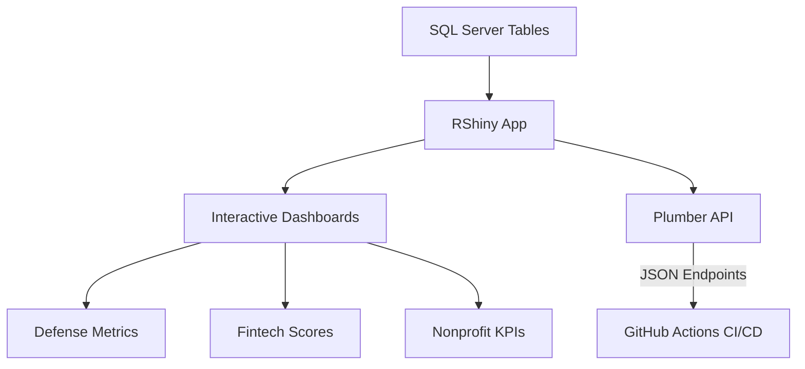

# 🛍 Founder's Flight Deck – Day 1: Cross-Functional Mastery

**Inspired by IMD’s Foundations for Business Leadership**
**Curated by: Erwin Maurice McDonald**
*Program Goal: Simulate elite executive training for AI-powered strategy delivery.*

> This dashboard app runs three parallel client simulations—Defense, Fintech, and Nonprofit—within a unified RShiny interface using SQL Server and R-based APIs.

---

## 🧰 Shields.io Badges


---

## ⚙️ Tech Stack


---

## 🔗 Clickable Sections

* [🛍 Day 1 Objective](#🛍-founders-flight-deck-–-day-1-cross-functional-mastery)
* [📊 Sector Dashboards](#🌈-sample-r-code-appr)
* [🧪 Workflow Diagram](#📈-workflow-diagram-mermaid)
* [💻 Running Outside Localhost](#💻-running-outside-localhost)
* [📁 Folder Layout](docs/deployment-notes.md)
* [🔧 Deployment Notes](docs/deployment-notes.md)

---

## 💻 Running Outside Localhost

This app defaults to localhost but supports:

* Hosting via [shinyapps.io](https://www.shinyapps.io/)
* Reverse proxy via Nginx
* Containerization via Docker (future step)
* API exposure via `/api/plumber.R`

---

## 🧹 Sample R Code (`app.R`)

<details>
<summary>📄 Click to expand `app.R` source code</summary>

```r
library(shiny)
library(DBI)
library(odbc)
library(DT)
library(shinyWidgets)
library(plotly)
library(ggplot2)

# Establish DB connection
con <- tryCatch({
  dbConnect(odbc::odbc(),
    Driver = "ODBC Driver 17 for SQL Server",
    Server = "5CD147L68L\\Veteran",
    Database = "FlightDeckDB",
    Trusted_Connection = "Yes"
  )
}, error = function(e) {
  stop("Database connection failed: ", e$message)
})

# Load data
pipeline <- dbReadTable(con, "PipelineData")
compliance <- dbReadTable(con, "ComplianceData")
fintech <- dbReadTable(con, "FintechData")
nonprofit <- dbReadTable(con, "NonprofitData")

# UI
ui <- fluidPage(
  tags$head(
    tags$style(HTML("
      body { background-color: #121212; color: white; }
      table.dataTable tbody td { color: white; }
      .dataTables_wrapper .dataTables_filter input { color: black; }
      .shiny-input-container { color: white; }
    "))
  ),
  titlePanel("🛍 Founder's Flight Deck"),
  tabsetPanel(
    tabPanel("Defense",
      plotlyOutput("defense_plot"),
      dataTableOutput("defense_table")
    ),
    tabPanel("Fintech",
      plotlyOutput("fintech_plot"),
      dataTableOutput("fintech_table")
    ),
    tabPanel("Nonprofit",
      plotlyOutput("nonprofit_plot"),
      dataTableOutput("nonprofit_table")
    )
  )
)

# Server
server <- function(input, output) {
  output$defense_plot <- renderPlotly({
    plot_ly(pipeline, x = ~Date, y = ~KPI_Index, type = 'scatter', mode = 'lines+markers', color = ~Sector) %>%
      layout(title = "Defense KPI Index")
  })

  output$defense_table <- renderDataTable({
    datatable(pipeline, options = list(pageLength = 5))
  })

  output$fintech_plot <- renderPlotly({
    plot_ly(fintech, x = ~Date, y = ~FairnessScore, type = 'bar', color = ~Sector) %>%
      layout(title = "Fintech Fairness Score")
  })

  output$fintech_table <- renderDataTable({
    datatable(fintech, options = list(pageLength = 5))
  })

  output$nonprofit_plot <- renderPlotly({
    plot_ly(nonprofit, x = ~Date, y = ~EngagementLevel, type = 'scatter', mode = 'lines+markers', color = ~Sector) %>%
      layout(title = "Nonprofit Engagement Level")
  })

  output$nonprofit_table <- renderDataTable({
    datatable(nonprofit, options = list(pageLength = 5))
  })
}

shinyApp(ui, server)
```

</details>

---

## 📈 Workflow Diagram (Mermaid)

> GitHub won't render this inline in the homepage README. For best results, see: [docs/workflow.md](docs/workflow.md)




